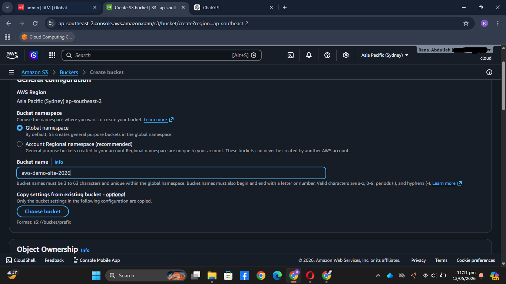
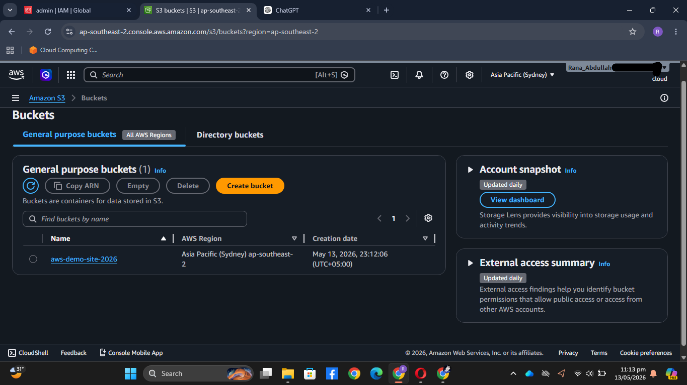
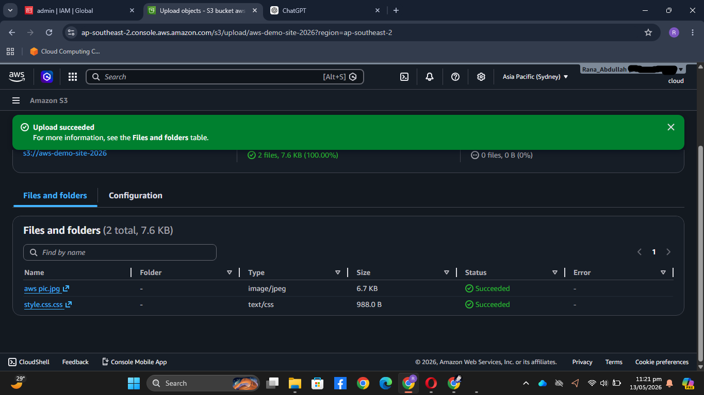

# AWS S3 Bucket & Object Upload Lab

## Project Overview
This lab demonstrates how to create an Amazon S3 bucket and upload static web assets using the AWS Management Console. 

## Cloud Architecture Components
- **Cloud Provider:** Amazon Web Services (AWS)
- **Service:** Amazon S3 (Simple Storage Service)
- **AWS Region:** Asia Pacific (Sydney) `ap-southeast-2`
- **Bucket Name:** `aws-demo-site-2026`
- **Objects Uploaded:** `aws_pic.jpg`, `style.css`

---

## Step-by-Step Implementation

### Step 1: Bucket Configuration & Creation
The S3 bucket was configured with the unique name `aws-demo-site-2026` within the Global Namespace and deployed in the Sydney region.

---

### Step 2: Resource Verification
Verified that the bucket was successfully provisioned and active on the S3 dashboard.

---

### Step 3: Object Upload
Successfully uploaded the project assets (`aws_pic.jpg` and `style.css`) to the root directory of the bucket with a 100% completion rate.

---

## Key Skills Demonstrated
- AWS Console Navigation
- Object Storage Management
- Cloud Resource Ingestion & Verification
- Technical Documentation
